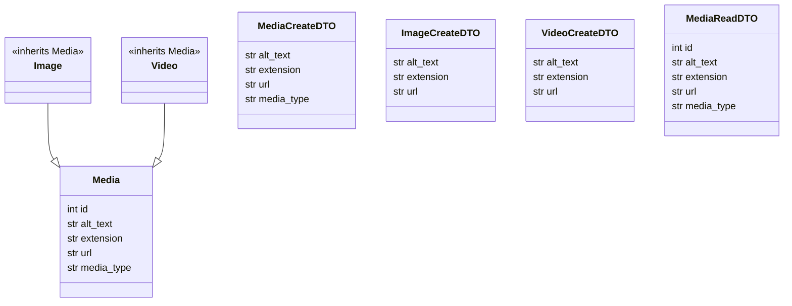
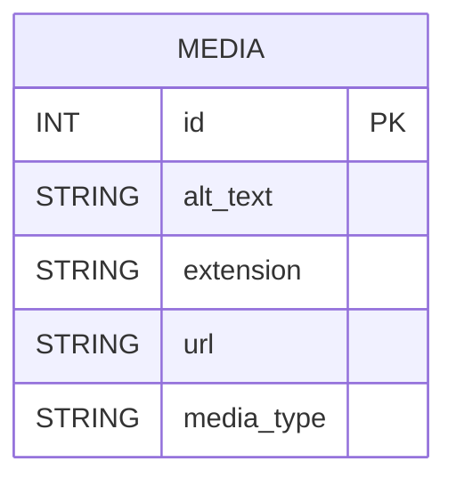
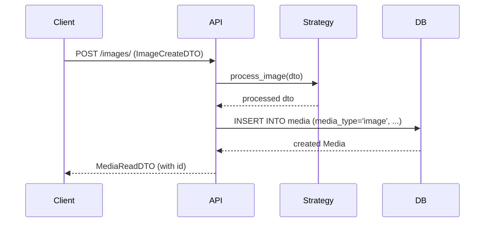

# MediaManager

A FastAPI-based media management service using SQLModel (SQLAlchemy), with strategy pattern for media processing and robust test/migration setup.

## Features
- Single-table inheritance: all media types stored in one `media` table with a `media_type` discriminator column.
- Strategy pattern: pluggable processors for image/video/media types.
- DTO-ready: use Pydantic/SQLModel models for request/response schemas.
- Robust test isolation: in-memory SQLite, dependency overrides, and explicit table creation in tests.
- Migration scripts for DB schema evolution.

## Quickstart

### 1. Install dependencies
```bash
pipenv sync --dev
```

### 2. Activate environment
```bash
pipenv shell
```

### 3. Run the app
```bash
uvicorn src.main:app --reload
```

App will be available at [http://127.0.0.1:8000](http://127.0.0.1:8000)

### 4. Run tests
```bash
pytest -q
```

### 5. Run migration (if upgrading schema)
```bash
python3 scripts/migrate_add_media_type.py
```

### 6. Inspect DB
```bash
python3 scripts/db_inspect.py
```

## Project structure
- `src/database.py` — engine, session, and `get_db` dependency
- `src/main.py` — FastAPI app, router registration (no auto table creation)
- `src/routes/media_routes.py` — models, endpoints, strategy usage
- `src/strategies/media_strategy.py` — strategy pattern for media processing

## Architecture Diagrams

### Class Diagram


### Entity Relationship Diagram (ERD)

*All media types (image, video, etc.) are stored in the MEDIA table, distinguished by the media_type column.*

### Sequence Diagram: Create Image

*Shows the flow for creating an image: request, strategy processing, DB insert, and response.*

## Testing conventions
- Tests use in-memory SQLite (`sqlite:///:memory:`) with `StaticPool`.
- Dependency overrides ensure tests never touch production DB.
- Table creation is explicit in test fixtures.

## Migration & schema management
- Never call `SQLModel.metadata.create_all(engine)` at import time in production code.
- Use migration scripts (see `scripts/migrate_add_media_type.py`) to add new columns.
- Always back up the production DB before running migrations.

## DTOs
- Use Pydantic or SQLModel models for request/response schemas.
- Example:
```python
from pydantic import BaseModel
class MediaDTO(BaseModel):
    id: int
    alt_text: str
    extension: str
    url: str
    media_type: str
    model_config = {'from_attributes': True}
```

## Strategy pattern
- Register processors for each media type in `src/strategies/media_strategy.py`.
- Endpoints call the processor before saving media.

## Useful commands
- Start app: `uvicorn src.main:app --reload`
- Run tests: `pytest -q`
- Run migration: `python3 scripts/migrate_add_media_type.py`
- Inspect DB: `python3 scripts/db_inspect.py`

## Contributing
- See `agents.md` for agent/developer workflow, TDD, and troubleshooting.

---

For questions or improvements, see `agents.md` or open an issue.
